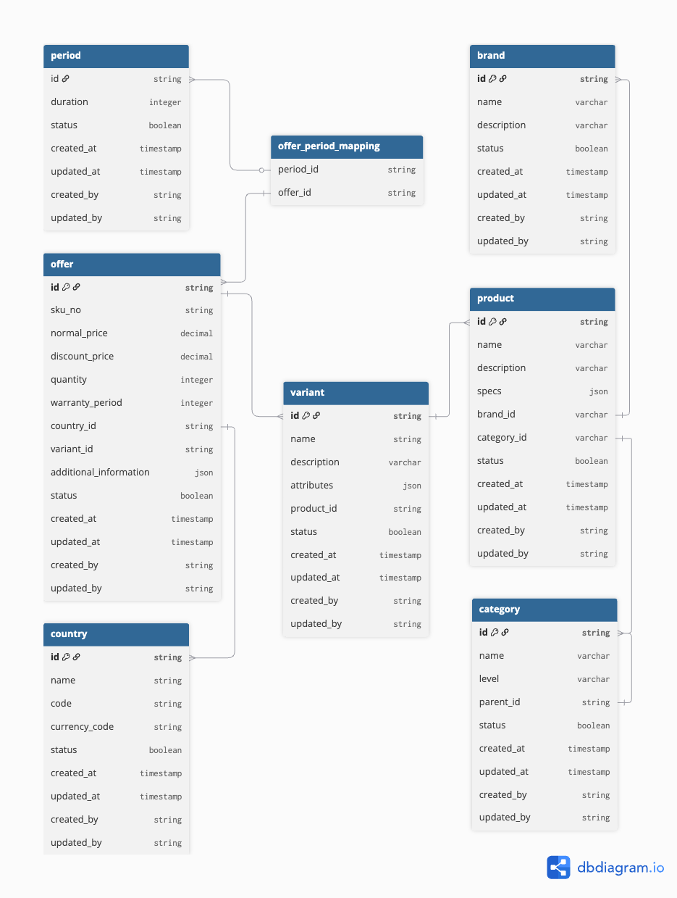

# Rent-Service 

## Tech Overview

This service is developed using Python 3 with the [FastAPI framework](https://fastapi.tiangolo.com/) for HTTP handling, [SQLAlchemy](https://www.sqlalchemy.org/) for ORM, and [PostgreSQL](https://www.postgresql.org/) as the database.

The folder structure, class design, and Python files are structured trying to follow [Clean Architecture](https://blog.cleancoder.com/uncle-bob/2012/08/13/the-clean-architecture.html) principles by Uncle Bob. Additionally, the python code in this project is trying to adopts [Reactive Programming](https://en.wikipedia.org/wiki/Reactive_programming) concepts.Therefore, all functions are implemented asynchronously.

By leveraging Reactive Programming, the workers that handle the code logic are non-blocking, enabling them to process requests concurrently and parallel.

As a result, this application is optimized for high performance, capable of handling a high number of requests per second, and is well-suited for large-scale user bases.

## Bussiness Overview

This service allows customers to browse and rent various **product variants** based on:

- Selected **country**
- Available **offers**
- Configurable **rental periods**

Each rental offer is dynamically tailored per **country** and **duration**, enabling localization and customization of prices.

## Entity Relationship Diagram


---

## 🏗️ Database Structure

### 🔹 Brand

- One **brand** can have multiple **products**.
- Stores metadata like brand name, description, and status.

### 🔹 Product

- A **product** belongs to one **brand** and one **category**.
- One product can have many **variants**.
- Contains product-level information like name and specs.

### 🔹 Variant

- A **variant** represents a specific configuration of a product.
- One variant can have many **offers**.

### 🔹 Offer

- Tied to a **variant** and a **country**.
- Contains pricing logic including `normal_price`, `discount_price`, and `quantity`.
- Each offer can be available for multiple **periods** via `offers_periode_mapping`.

### 🔹 Periode

- Defines rental duration (e.g., 1 month, 3 month, 6 month).
- Linked to offers through `offers_periode_mapping`.
- Critical for rent calculations.

### 🔹 Country
- Offers are country-specific.
- Each country defines its own currency and availability.

### 🔹 Category
- A hierarchical structure with parent-child relationships.
- Products are organized using categories and levels.

---

## 🔁 Data Flow Summary

- 🏢 One **brand** ➝ many **products** (One To Many)
- 📦 One **product** ➝ many **variants** (One To Many)
- 🔀 One **variant** ➝ many **offers** (One To Many)
- 🌐 Many **offers** ➝ many **periods** (via `offers_periode_mapping` - Many To Many)
- 🗺️ One **country** ➝ many **offers** (One To Many)

notes : 
```
The reason for offering a many-to-many relationship with the period entity is likely because each country may have different rental durations based on local policies or business decisions.
```

### Example Flow:

> A customer in **Indonesia** browses a **MacBook Pro** (Product) under **Apple** (Brand). They choose a **16GB RAM** variant and select an **offer** based on a **6-months** period with localized pricing and availability.

## Project Structure
    .
    ├── api                                         # Fast API Configuration
    │   ├── handler.py                                  # uvicorn configuration to run fast api services
    │   ├── router.py                                   # router to register endpoint
    ├── configs                                     # configs
    │   ├── database.py                                 # Database Configuration Class
    ├── models                                      # models (entity/pojo etc) folder
    │   ├── base.py                                     # Base model
    │   ├── brand.py                                    
    │   ├── category.py                                 
    │   ├── country.py                                  
    │   ├── offer_periode_mapping.py                    
    │   ├── offer.py                                    
    │   ├── period.py                                   
    │   ├── product.py                                  
    │   ├── variant.py                                  
    ├── resources                                   # resources folder
    │   ├── db_diagram.png                              # Database Diagram
    │   ├── example_request.sh                          # Example CURL Request
    │   ├── migration.sh                                # Migration script
    │   ├── RENT SERVICE.postman_collection.json        # Rent Service Postman Collection
    │   ├── rent_service.sql                            # Rent Service PostgreSQL Dump
    │   ├── response_multiple_result.json               # Example Multiple Result Json 
    │   ├── response_single_result.json                 # Example Single Result Json
    ├── shared                                      # Shared folder contains common class or function
    │   ├── builder                                     # Response Builder
    │   │   ├── response.py                                 
    │   ├── middleware                                  # Middleware Folder
    │   │   ├── exception_handler.py                        # Exceptions Handler
    │   ├── utils                                       # Utils Folder
    │   │   ├── context_filter.py                           
    │   │   ├── current_thread.py                           
    │   │   ├── logger.py                                   
    │   ├── variables                                   # All Constant & Env Variable
    │   │   ├── base.py                                     
    │   │   ├── constant.py                                 
    │   │   ├── database.py                                 
    ├── src                                         # Source Code Of Modules
    │   ├── delivery                                    # delivery Layer for client facing like api, grpc or graphql
    │   │   ├── graphqlhandler                              # Dummy Folder for next improvement
    │   │   ├── grpchandler                                 # Dummy Folder for next improvement
    │   │   ├── resthandler                                 # RestHandler Folder that contains controller
    │   │   │   ├── healthcheck_controller.py                   
    │   │   │   ├── product_controller.py                       
    │   │   │   ├── variant_controller.py                       
    │   ├── domain                                      # Domain Layer contains to wrap the parameter
    │   │   ├── base_domain.py                            # follow the one of clean code pattern rules 
    │   │   ├── variant_domain.py                         # if the function have more 4 parameter, we need to wrap into a class
    │   ├── repository                                  # Repository Layer for all logic to get the data from databases
    │   │   ├── period_repository.py                        
    │   │   ├── product_repository.py                       
    │   │   ├── variant_repository.py                       
    │   ├── usecase                                     # Usecase Layer for all bussiness / application logic 
    │   │   ├── product_usecase.py                          
    │   │   ├── variant_usecase.py                          
    ├── .env                                        # Environment Variables
    ├── .gitignore                                  # .gitignore
    ├── main.py                                     # main application to run rent-services
    ├── README.md                                   # this file
    └── requirements.txt                            # list of library

## Project Setup and Execution Guide

This guide provides step-by-step instructions for setting up and running the Rent-Service

### Table of Contents

- [Clone the Repository](#clone-the-repository)
- [Database Migration](#database-migration)
- [Postman Collection](#postman-collection)
- [Virtual Environment](#virtual-environment)
- [Configuration](#configuration)
- [Run the Application](#run-the-application)
- [Test the Application](#test-the-application)

### Clone the Repository
```bash
git clone https://github.com/adhit06/rent-service.git
cd rent-service
```

### Database Migration
Make sure you have a local PostgreSQL instance running and accessible.
Then execute the migration script to create tables and seed the database:
```bash
chmod +x resources/migration.sh
./resources/migration.sh
```
notes : 
```
If the migration script does not work, please perform a manual data dump using terminal commands or database tools such as DBeaver, Valentina Studio, or other preferred alternatives.
```

### Postman Collection
1. Open Postman Desktop App.
2. Click "Import".
3. Select the file: resources/RENT SERVICE.postman_collection.json.
4. Explore and test available API endpoints interactively.
### Virtual Environment
If you're using Anaconda or Miniconda  
1. Create a virtual environment:
```bash
conda create -n rent-service python=3.9
```
2. Activate the Environment :
```bash
conda activate rent-service
```
2. Install Dependencies :
```bash
pip install -r requirements.txt
```

### Configuration
Configure the environment variables based on the values specific to your local machine.
```bash
ENVIRONMENT=development #default env
PORT=8000 #default port
KEEPALIVE=61 #the number must be greater than 1 second from keepalive load ballancer

APP_NUM_WORKERS = 1
APP_HASH = "db7794e" #this is example, in production will get from has commit id
APP_VERSION = "v0.1"

DATABASE_POOLSIZE        = 10 #total connection per pool (1 worker will 1 pool)
DATABASE_POOL_MINCACHED  = 1 #min pool cached
DATABASE_NAME            = "rent_service" #database name
DATABASE_READER_HOST     = "localhost" #your reader postgre host
DATABASE_WRITER_HOST     = "localhost" #your writer postgre host
DATABASE_USER            = "postgres" #your postgre user
DATABASE_PASSWORD        = "postgres" #your postgre password
DATABASE_DIALECT         = "postgresql+asyncpg"
DATABASE_PORT            = "5432" #postgre port
```
### Run the Application
Please make sure the virtual environment you previously created is activated.
```bash
python3 main.py
```

### Test the Application
Open the **Postman** desktop or web application, then open the `rent-service` collection that you previously imported.

This service provides the following key endpoints:

- **`GET /healthcheck`**  
  Used to verify that the service is running and responsive.

- **`POST /product/{country}/{id}`**  
  Retrieves detailed information about a **single product**, suitable for a product detail page (e.g., [Cinch Detail Page](https://cinch.sg/product/dell-mon-del-u2722de)).

- **`POST /variant/{country}`**  
  Returns a list of **filtered products** based on various criteria such as name, country, category, brand, price range, and rental period.  
  Ideal for implementing product search pages (e.g., [Cinch Products Page](https://cinch.sg/products))


This `README.md` file provides clear and organized instructions, ensuring that users can easily follow the steps to set up and run the project.